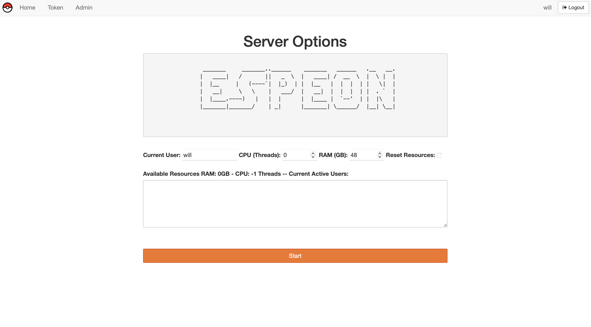

# jupyterhub-auto

Automatic Lab JupyterHub
========================

This bash script helps someone install a JupyterHub instance with RAM and CPU resorce managment. One can also use this script to auto install conda, as well as customize their JupyterHub login page.

Login Page
-----------

Resource Managment
-------------------

Motivation & Features
---------------------

- Insall conda
- Install JupyterHub
- Install systemdspawner for resource managment
- Customize resource managment
- Create shared drive space
- Customize the look of JupyterHub
- SSL encryption of traffic
- Creates a jupyterhub service

BASIC Installation
------------------

- cd ./repo/path/
- bash jupyter_auto.sh

- Is Conda Installed? n
- Anaconda Year (2021) 2021
- Anaconda Month (11) 11
- Pleas answer 'yes' or 'no' yes
- [/home/username/anaconda3] Enter
- Do you want the installer to initialize Anaconda3? yes
- source ~/.bashrc
- bash jupyer_auto.sh
- Is Conda Installed? y
- Have You Edited The localsettings.py File y
- Have You Edited The teamplates/ Folder Files y
- Install Packages y
-      Type Y for any package that requires a responce from install
-      Type blanks answers or actual answers into ssl-keygen responces
- Please Type In The First Two Digits of Python X.YY.Z   X.YY
- sudo service jupyterhub restart
- sudo service jupyterhub enable

Editing Settings
-----------------

- Change ./templates/jhub_logo.png
- Change img URL and footer text in ./templates/login.html
- Change title in ./templates/page.html
- Change ascii in ./spawner/ascii_art.py
- Add entire culling_add2config.py to the end of /opt/jupyterhub/jupyterhub_config.py to add culling of instances
- To add Real-Time-Collaboration, follow my comment https://github.com/jupyterhub/jupyterhub/issues/3578 here

Add yourself to the GROUP_NAME
------------------------------

- sudo usermod -a -G GROUP_NAME username
- Logout and Back In Again

Add manager users to MANAGER group
----------------------------------

- sudo usermod -a -G MANAGER username

Connecting to VS-Code
---------------------

(VS) = Found in VS-Code
(JH) = Found in JupyterHub after login
(Serv) = Server running JupyterHub

- (VS) Under File > Preferences > Settings find "Allow Unauthorized Remote Connections" and make sure that it is checked. The SSL certificate for JupyterHub is self assigned which means you need to make sure VS-Code can approve this type of connection
- (VS) Download the SSH extension
- (VS) Create a remote SSH connection to the server running JupyterHub
- (VS) Download the jupyter extension on the remote server
- (Serv) Install jupyterlab-link-share to your JupyterHub instance
- (Serv) restart JupyterHub
- (JH) Log into JupyterHub server
- (JH) Once your instance is running, click on the share tab and copy the provided link.
- (JH) Trunkate the link to this format https://localhost:8000/user/[username_here]/?token=[copy_this_from_share_button]
- (JH) https://localhost:8000/user/prof_oak/?token=12345678abc
- (VS) Search for "Specify Jupyter Server For Connection"
- (VS) Paste the trunkated link into the prompt
